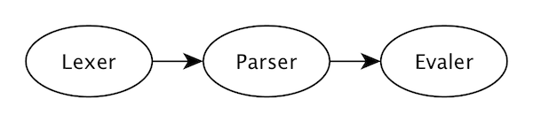

At Aviasales we rewrote our search engine in Go. 

One of the critical parts of that engine is a business rule engine. With lots of incoming parameters, it's not always possible to describe constantly changing business rules in code. To solve this problem we wrote an expression engine. The idea is
to let configure things in a dynamic way without recompiling the program. 

In this talk, I've explained how to write your own expression engine. Starting from lexer, parser and Go's reflection for static typing, to an evaluation of a compiled program. 

<div class="video">
    <iframe width="560" height="315" src="https://www.youtube.com/embed/H8knueJSJ9g" frameborder="0" allow="accelerometer; autoplay; encrypted-media; gyroscope; picture-in-picture" allowfullscreen></iframe>
</div>

> [Slides](https://speakerdeck.com/medv/how-to-write-an-expression-engine)



Let's start with the theory. As probably everyone knows most of the programming languages consist of Lexer, Parser and 
Compiler. But since we are writing the expression engine instead of the Compiler, we will have an Evaler. Lexer reads the original string and produces tokens, the parser receives tokens and produces an abstract syntax tree, Evaler executes this tree with a specified context.

Let's start with Lexer.

There are many ways to write a lexer, the two most common ones are using a bunch of regular expressions, or using a state machine. We will use a state machine.

Lexer reads the input string character by character and produces tokens made of two elements: the type of the token and a value. For expression engine, we need only a few types of tokens:

* Name - to designate variables,
* Number - for numbers,
* Text is for strings,
* Operator for operators,
* Punctuation and special token end of file

```go
const (
	name tokenKind = iota
	number
	text
	operator
	punctuation
	eof = -1
)
```

To describe the state of our state machine, we will use a special function that takes a lexer and returns the next state function.

The lexer itself will store an input string, a position in the input string, and a list of produced tokens.

```go
type token struct { 
	  kind  tokenKind 
	  value string      
}
```

The lex function will store the state of the state machine in a loop, starting with the special state lexRoot, until nil is received, informing about the completion of the lexer operation, after which we can return the list of produced tokens.

```go
type stateFn func(*lexer) stateFn

type lexer struct {
	input    string
	pos      int  
	tokens   []token
}

func lex(input string) []token {
	l := &lexer{
		input:  input,
		tokens: make([]token, 0),
	}
	for state := lexRoot; state != nil; {
		state = state(l)
	}
	return l.tokens
}
```

lexRoot gets the next character from the input string and decides which state to "go" to our state machine. For example, if the quote character is encountered, go to the lexQuote state.

```go
func lexRoot(l *lexer) stateFn {
	switch l.next(); {
	// ...
	case '"':
		return lexQuote
	// ...
	}
	return nil
}
```

lexQuote absorbs all characters until the next quote is encountered and produces a token with a text type and a value collected between two quotes (the code to skip the escaped quotes is omitted). After state can go back to the lexRoot state.

```go
func lexQuote(l *lexer) stateFn {
	str := ""
	for {
		ch := l.next()
		if ch == '"' {
			break
		}
		str += string(ch)
	}
	l.tokens = append(l.tokens, token{text, str})
	return lexRoot
}
```

After the lexing step is finished, we get a list of tokens and their values.

```go
[]token{
	{kind: number, value: "1"},
	{kind: operator, value: "+"},
	{kind: number, value: "2"},
	{kind: eof},
}
```

To write a parser we need a context-free grammar, of course, there are many parser generators (such as goyacc and others), but I want to show how you can write your own parser from scratch. I'll tell you how to write a simple LL (1) recursive descent parser.

First of all, what is context-free grammar?
It is:
* A set of terminal symbols (tokens). 
* A set of nonterminals (syntactic variables). 
* A set of productions, where each production consists of a nonterminal, called the head or left side of the production, an arrow, and a sequence of terminals and/or nonterminals, called the body or right side of the production. 
* A designation of one of the nonterminals as the start symbol.

Let’s take a look at a simple grammar: 

```
S → S + S
S → 1
S → a
```

It consists of one nonterminal S; three terminals: plus, one, and a; three production rules; and the starting symbol S.


For example, to get `1 + 1 + a` input line from this grammar we start with the starting symbol S and use the first production as a simple replacement rule, replace S by S + S. Next, replace the first occurrence of S by 1 according to the second production rule and so on until we get the original string. Thus, proving that this line belongs to the language described by this grammar. This process is called derivation.

```
S → S + S
  → 1 + S
  → 1 + S + S
  → 1 + 1 + S
  → 1 + 1 + a
```


Choosing each time a leftmost nonterminal, we got such parse tree, but if we would choose a rightmost nonterminal each time, we would get another parse tree,

```
S → S + S
  → S + a
  → S + S + a
  → S + 1 + a
  → 1 + 1 + a
```


It is important to know whether the parser determines a leftmost or a rightmost derivation because this determines the order in which the pieces of code will be executed.

For example, in the following grammar, we can get two parse trees, but only the right parse tree is valid since we know what the order of the operators is.

```
S → [a-z]
S → S + S
S → S * S
S → (S)
```

Input is `x + y * z`


If a string in the language of the grammar has more than one parsing tree, then the grammar is said to be an ambiguous grammar.

We can fix the situation by entering the following corrections into the grammar. 

```
T → [a-z]
S → S + T
S → S * T
T → (S)
S → T
```

We added an additional nonterminal and implicitly encourage correct priorities of operators.

Let’s now turn our expression grammar into a code, Each production rule transforms into a function and each nonterminal in the body of productions is represented as a call to the corresponding function. However, we immediately encounter a problem: the second production rule calls itself and our program gets stuck. This is called left-recursive production. However, we can again slightly modify our grammar.

The left recursion can be eliminated by rewriting incorrect production rules.

```
A → A ⍺ | β 
```

Into right-recursive production:

```
A → β R
R → ⍺ R | ∅
```

Now consider a more complex grammar containing the operations of addition and multiplication. 

```
expr   → expr + term | expr - term | term
term   → term * factor | term / factor | factor
factor → ( expr ) | var
var    → [a-z0-9]+
```

This grammar contains left-recursive production rules. Applying the transformation rule, we can rewrite them all into left-recursive ones.

```
expr   → term exprR
exprR  → + term exprR | - term exprR | ∅
term   → factor termR
termR  → * factor termR | / factor termR | ∅
factor → ( expr ) | var
var    → [a-z0-9]+
```

Now we can rewrite the grammar into a code since now the choice of production is at the beginning of each recursive production.

Let's define the nodes of our abstract syntax tree. And for simplicity, our AST will consist only from one node - binaryNode. For simplicity, we also replace token structs with strings.

```go
type token = string

type node interface{}

type binaryNode struct {
	op    token
	left  node
	right node
}
```

We introduce helper functions Next and Match.
Next returns the next character from the list of tokens,
And Match checks a current terminal called lookahead with given terminal, if it matches, moves the lookahead to the next terminal.

```go
var tokens []token

func next() token {
	if len(tokens) > 0 {
		x := tokens[0]
		tokens = tokens[1:]
		return x
	}
	return ""
}

var lookahead = next()

func match(terminal token) {
	if lookahead == terminal {
		lookahead = next()
	} else {
		panic("expected token " + terminal)
	}
}
```

Further, simply rewriting the production rules as they are, recursive products begin with the terminal by which we can choose what productions to use, empty productions (empty else) are omitted here.

```go
func expr() {
	term()
	exprR()
}

func exprR() {
	if lookahead == "+" {
		match("+")
		term()
		emit("+")
		exprR()
	} else if lookahead == "-" {
		match("-")
		term()
		emit("-")
		exprR()
	}
}

func term() {
	factor()
	termR()
}

func termR() {
	if lookahead == "*" {
		match("*")
		factor()
		emit("*")
		exprR()
	} else if lookahead == "/" {
		match("/")
		factor()
		emit("/")
		exprR()
	}
}
```

In atom production rule, we check that the current token fits our definition of atom and add it to the special stack, which contains all the atoms in the Reverse Polish Notation, and in the emit function gets the last two elements from the stack, creates a binaryNode and puts it back on the stack this is called Postfix algorithm)

```go
func factor() {
	if lookahead == "(" {
		match("(")
		expr()
		match(")")
	} else {
		atom()
	}
}

func atom() {
	if check.MatchString(lookahead) {
		stack = append(stack, lookahead)
		lookahead = next()
	} else {
		panic("expected atom")
	}
}

func pop() node {
	top := stack[len(stack)-1]
	stack = stack[:len(stack)-1]
	return top
}

func emit(op token) {
	right := pop()
	left := pop()

	node := binaryNode{
		op,
		left,
		right,
	}
	stack = append(stack, node)
}
```

Now we can call our start symbol and if everything went well and we did not catch any panic then on top of the stack will be our abstract syntactic tree.

```go
func main() {
	tokens = lex(os.Args[1])
	lookahead = next()

	expr()
	fmt.Println(pop())
}
```

A full example of the parser can be found by [this link](https://goo.gl/Qxegrd). Let's try to run and test our parser, as you see it is left-recursive, it correctly parses the priority of operators and understands the parentheses.

```
$ go run parser.go x+y+z
{+ {+ x y} z}

$ go run parser.go x+y*z
{+ x {* y z}}

$ go run parser.go "(x+y)*z"
{* {+ x y} z}
```

Now to Evaler. To execute our AST we will extend the node interface and add an eval() method.

```go
type node interface {
	eval() interface{}
}

func main() {
	program := parse(os.Args[0])

	out := program.eval()
	fmt.Println(out)
}
```

Here is an example of implementing the eval() method for binaryNode, eval the left and right parts. Then perform an action, depending on the operator. Keep in mind, that in order it to work, we need to write additional AST nodes for constants and variables.

```go
func (n binaryNode) eval() interface{} {
	left := n.left.eval()
	right := n.right.eval()

	switch n.op {
	case "+":
		return left.(int) + right.(int)
	case "-":
		return left.(int) - right.(int)
	case "*":
		return left.(int) * right.(int)
	case "/":
		return left.(int) / right.(int)
	}

	panic("unknown operator")
}
```

Let's try to run our calculator and check the results. All right?

```
$ go run eval.go 1+2*3
7

$ go run eval.go 2*(1-3)
-4

$ go run eval.go 2*2
4
```

I wrote [my expression engine](https://github.com/antonmedv/expr) called *expr*.

```ruby
# Get the special price if
user.Group in ["good_customers", "collaborator"]

# Promote article to the homepage when
len(article.Comments) > 100 and article.Category not in ["misc"]

# Send an alert when
product.Stock < 15
``` 
 
It understands all of these expressions, and has user-friendly errors and type checks.

Here is an example of a parser error for invalid code.

```
unclosed "("
(boo + bar]
----------^
```
 
It’s convenient, so we can check what a rule is written correctly at the stage of saving config. Expr also uses reflection, so we do not need to define types separately but can use those that are already in our Go code.

```go
type Group struct {
	Name string
}
type User struct {
	Age int
}

code := "groups[0].Name + user.Age"

program, err := expr.Parse(
	code,
	expr.Define("groups", []Group{}),
	expr.Define("user", User{}),
)
```

```
invalid operation: groups[0].Name + user.Age
(mismatched types string and int)
```

The End.
