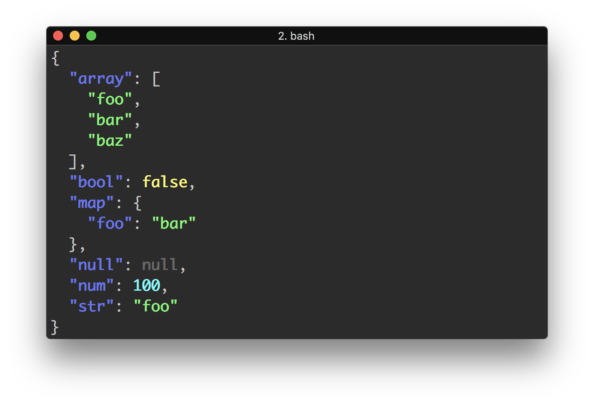
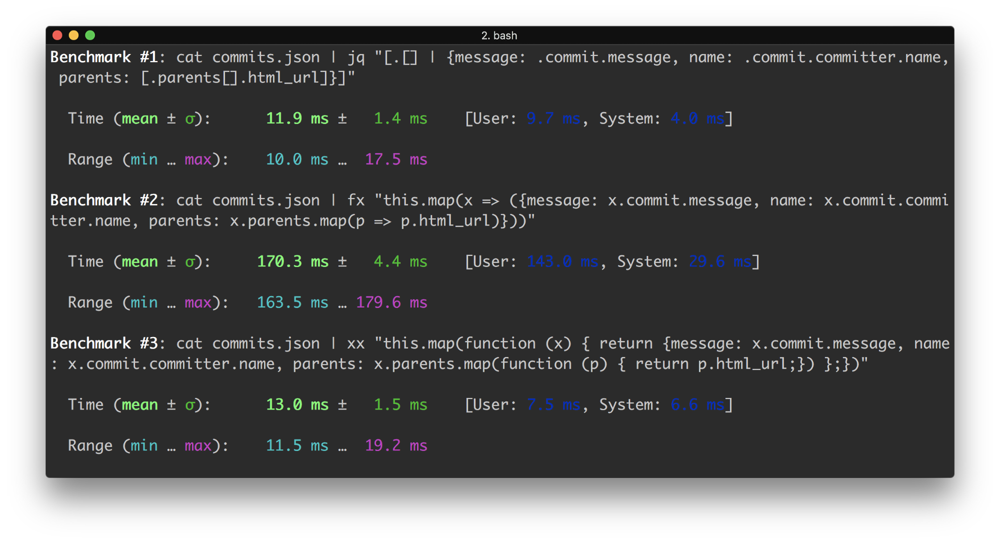
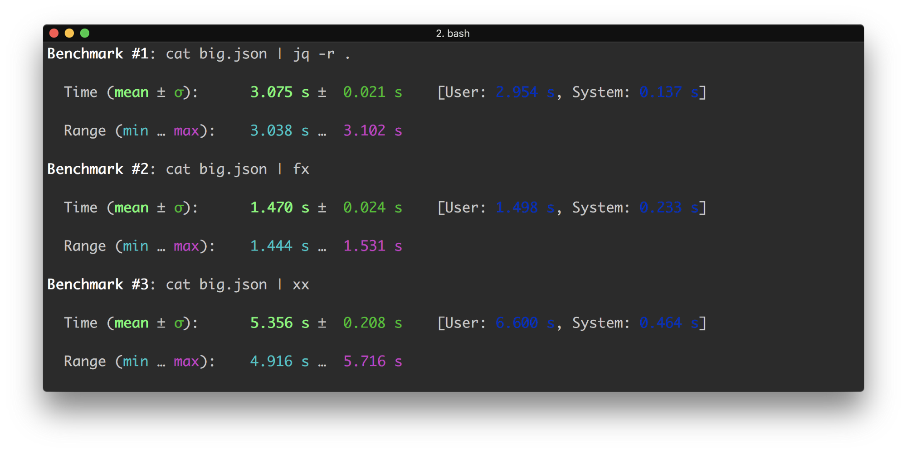

Bash is good for processing text, but nowadays a lot of stuff is JSON: configs, APIs, etc. And bash is horrible with 
manipulating JSON. Here we have various tool for processing JSON, and I think your heard or used one of them — jq.

But when I want to do something more complex with it I always fail as it has unfamiliar syntax, and, in fact, it is 
completely independent language. I wanted more simple and more familiar tool for working with JSON.

What is the best language to work with JSON? I think the answer is contained in its name — **JavaScript 
Object Notation**. So I created new tool 😁

In fact, two tools – in JavaScript and in Go:
* [fx](https://github.com/antonmedv/fx) (JavaScript, Node.js)
* [xx](https://github.com/antonmedv/xx) (Go, [Otto](https://github.com/robertkrimen/otto), a JavaScript interpreter in Go)

Main idea what you can pipe any JSON in it and pass anonymous function as argument. That’s it. Nothing to remember. 🤗

```bash
$ echo '{"foo": [{"bar": "value"}]}' | fx 'x => x.foo[0].bar'
value
```

**fx** has a lot of useful features. For example to simple get value from JSON start with `.` (dot), and you will get 
an unquoted, raw value:

```bash
$ echo '{"foo": "value"}' | fx .foo
value
```

You can refer to passed JSON object by `this` keyword. And it's possible to pass any number of anonymous functions 
for reducing JSON:


```bash
$ echo '{"foo": [{"bar": "value"}]}' | fx '.foo' 'this[0]' 'x => x.bar'
value
```

One of nice features of **fx** is updating JSON using spread operator:

```bash
$ echo '{"count": 100}' | fx '{...this, count: ++this.count}'
{
  "count": 101
}
```

Also **fx** and **xx** have standalone binaries (see releases pages on GitHub).

## Eat 🧀

Also I've created tool called [eat](https://github.com/antonmedv/eat), which can "eat" everything including **json**, 
**yaml**, **toml**, **xml**, **ini** and output JSON for next processing with **fx**:

```bash
$ cat response.xml | eat | fx .Document.Title
```

## Benchmarks

Let’s benchmark **fx/xx** with jq. For it we will be using awesome [hyperfine](https://github.com/sharkdp/hyperfine). 
We take jq’s example from tutorial on crunching GitHub API commit response.

```bash
cat commits.json | jq "[.[] | {message: .commit.message, name: .commit.committer.name, parents: [.parents[].html_url]}]"
cat commits.json | fx "this.map(x => ({message: x.commit.message, name: x.commit.committer.name, parents: x.parents.map(p => p.html_url)}))"
cat commits.json | xx "this.map(function (x) { return {message: x.commit.message, name: x.commit.committer.name, parents: x.parents.map(function (p) { return p.html_url;}) };})"
```



Node.js version was significantly slower then jq or xx. But this is due to big startup time of any node application. 
🤔 What if we benchmark on a really big file?

```
ll big.json
-rw-r--r--  1 anton  staff    36M 9 sep 00:07 big.json
```



**fx** performs twice faster than _jq_ written in C, and more than 3 times faster xx. But how JavaScript version can be 
faster? It’s because v8 faster jq, and [otto](https://github.com/robertkrimen/otto).

<p align="center">...</p>

So should we abandon jq? No, of cause not. But I hope that these new tools can be useful for somebody. And they will 
find their users 👐.
